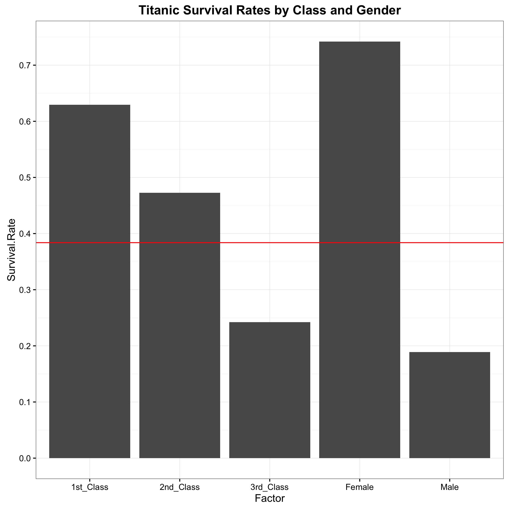
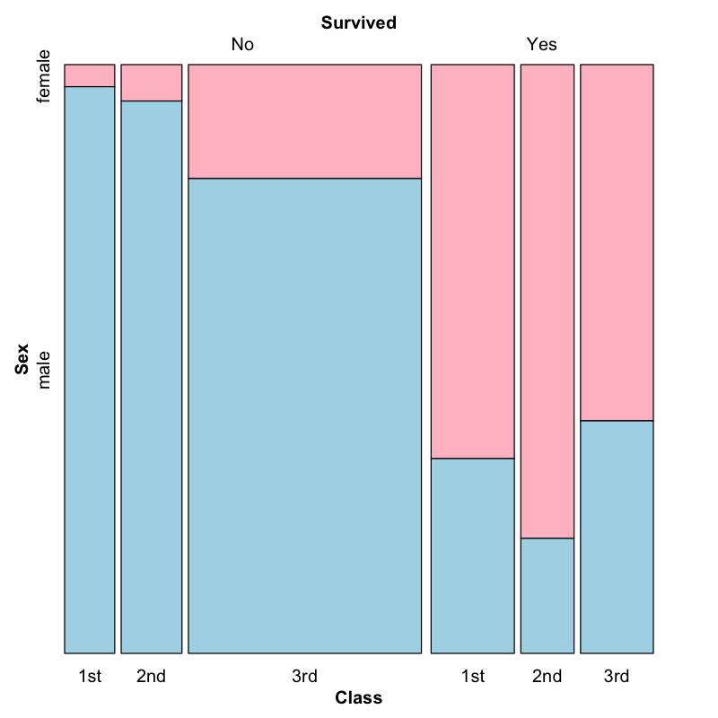
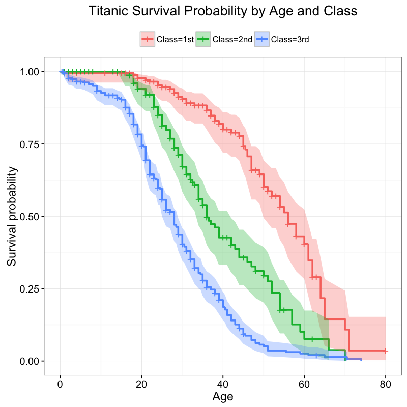
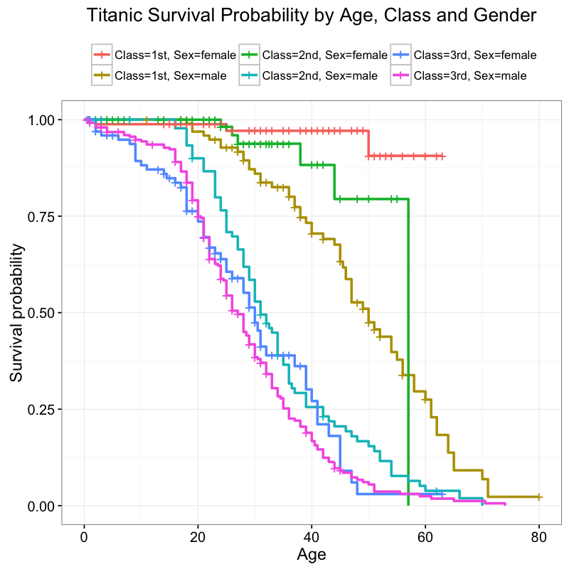

Titanic Survial Analysis
========

## Summary Survival Statistics 

**Passenger Survival Cross Tabulation**

|      |       | No |Yes| Sum |
|------|-------|----|---|---- |
|female| 1st   |  3 | 91|  94|
|      | 2nd   |  6|  70|  76|
|      | 3rd   | 72|  72| 144|
|      | Sum  |  81| 233| 314|
|male  | 1st|    77|  45| 122|
|      | 2nd    |91  |17 |108|
|      | 3rd |  300|  47| 347|
|      | Sum |  468| 109| 577|
|Sum   | 1st  |  80 |136 |216|
|      | 2nd |   97 | 87| 184|
|      | 3rd  | 372 |119 |491|
|      | Sum  | 549 |342 |891 |

**All Passengers Proportion Table**

  |      |        1st|        2nd|     3rd   |         Sum |
  |------|-----------|-----------|-----------|------------ |
  | female| 0.105499439| 0.085297419| 0.161616162| 0.352413019 |
  | male  | 0.136924804| 0.121212121| 0.389450056| 0.647586981 |
  | Sum   | 0.242424242 |0.206509540 |0.551066218| 1.000000000 |

Of 891 passengers, 342 survived, yielding a 38.38% overall survival rate.  The 577 males represented about 64.75% of all passengers, yet only 18.89% of all males survived. The 314 females represented 35.24% of all passengers, yet 74.24% of all females survived. 24.24% of passengers traveled in 1st Class, 20.65% in 2nd and 55.12% in 3rd.

The proportion tables below show the overall probabilities of surviving given gender and class. 

### Passenger Survival Proportion Tables

**Did Not Survive**

|        |        1st|      2nd |      3rd   |      Sum |
| -------|-----------|----------|------------|-----------| 
|  female| 0.003367003| 0.006734007| 0.080808081| 0.090909091 |
|  male  | 0.086419753| 0.102132435| 0.336700337| 0.525252525 |
|  Sum   | 0.089786756| 0.108866442| 0.417508418| 0.616161616 |

**Survived**

|        |      1st  |      2nd  |     3rd   |      Sum |
| -------|-----------|-----------|-----------|---------- |
|  female| 0.102132435| 0.078563412| 0.080808081| 0.261503928|
|  male  | 0.050505051| 0.019079686| 0.052749719| 0.122334456 |
|  Sum   | 0.152637486| 0.097643098| 0.133557800| 0.383838384 |



Over half the passengers were in 3rd class, and nearly 2/3 were male, yet these two groups have low survival rates. The average survival rate of 38% is not informative, as it hovers between the low rates of 3rd class and male passengers and the high rates of 1st class and female passengers. 

A mosaic plot is a helpful visual cross tabulation that shows 3rd class males as both the largest demographic on board, as well as the most likely to die. 



As well, we observe that survivors are younger on average (28.34 years) than the average age (29.7 years), and those who died are older (30.63 years).  Although the age variable contained 177 missing values, these were excluded from statistical summaries and tests and had no meaningful impact on the analysis. 

Given the stark differences observed between males, females, different classes and age, we narrow our focus to gender, class and age to investigate predictive survival factors. 

## Modeling Survival Outcomes

Since we're modeling a binary outcome, live or die, using mainly categorical predictors, logistic regression is appropriate, and
these coefficients give the change in the log-odds per each unit of increase. Though the model reduces residual deviance compared to a null model that only includes an intercept term, deviance is still high, meaning that the model leaves a large amount of unexplained variance. 

```
Deviance Residuals: 
    Min       1Q   Median       3Q      Max  
-2.7303  -0.6780  -0.3953   0.6485   2.4657  

Coefficients:
             Estimate Std. Error z value Pr(>|z|)    
(Intercept)  3.777013   0.401123   9.416  < 2e-16 ***
Class2nd    -1.309799   0.278066  -4.710 2.47e-06 ***
Class3rd    -2.580625   0.281442  -9.169  < 2e-16 ***
Sexmale     -2.522781   0.207391 -12.164  < 2e-16 ***
Age         -0.036985   0.007656  -4.831 1.36e-06 ***
---
Signif. codes:  0 ‘***’ 0.001 ‘**’ 0.01 ‘*’ 0.05 ‘.’ 0.1 ‘ ’ 1
```
The model shows significant relationships between survival, age, class and gender. Once exponeniated, the coefficents tell us the percent change in the odds for each predictor when all other factors are held constant.  The confidence intervals are rather wide, however, as the model still leaves quite a bit of unexplained deviance (noise). This is particularly true for 2nd class passengers, who are not as well-represented in the dataset.

* Odds of surviving if in 2nd class are 73% lower
* Odds of surviving if in 3rd class are 92% lower
* Being male means 92% lower odds of survival
* For each year older, 4% lower odds of survival

**Exponentiated Coefficients with 95% Confidence Interval**

|           |            |  2.5 %   |  97.5 % |
|-----------|------------|----------|----------|
|(Intercept)| 43.68534331| 20.37890724| 98.3863313|
|Class2nd   |  0.26987422|  0.15515074|  0.4621731|
|Class3rd   |  0.07572664|  0.04299250 | 0.1297997|
|Sexmale    |  0.08023617|  0.05293643|  0.1194848|
|Age        |  0.96369033|  0.94905346|  0.9780124|

We double checked the model fit with a stepwise analysis of variance that drops variables one at a time and compared the change in deviance using AIC and likelihood ratio: 

```
Single term deletions

Model:
Survived ~ Class + Sex + Age
       Df Deviance    AIC     LRT  Pr(>Chi)    
<none>      647.28 657.28                      
Class   2   749.96 755.96 102.674 < 2.2e-16 ***
Sex     1   827.16 835.16 179.881 < 2.2e-16 ***
Age     1   672.43 680.43  25.148 5.311e-07 ***
---
Signif. codes:  0 ‘***’ 0.001 ‘**’ 0.01 ‘*’ 0.05 ‘.’ 0.1 ‘ ’ 1
```

A logistic regression is said to provide a better fit to the data if it demonstrates an improvement over a model with fewer predictors. This is performed using the likelihood ratio test (LRT), which compares the likelihood of the data under the full model against the likelihood of the data under a model with fewer predictors.

Lastly, the Hosmer-Lemeshow goodness of fit test also shows no significant difference between values fitted by our model and the
observed values.

```
	Hosmer and Lemeshow goodness of fit (GOF) test

data:  test_factors$Survived, fitted(fit)
X-squared = 32.677, df = 8, p-value = 7.041e-05
```

## Survival Probability under Prediction Model

Survival analysis confirms that age, gender and class are significant predictors. Female, upper class and younger passengers are more likely to survive. Two interesting comparisons are 2nd class males and females, where being female made survival much more likely, and 1st class males and other male groups, where upper class booking greatly increased survival. 






## Conclusion
Although gender, age and class are all significant predictors of survival, these factors applied unevenly to Titanic passengers. For example, though males generally had low survival probability, first class males were an exception, surviving at higher rates than other males. Similarly, although females survived at generally higher rates, this is more true for first class females than for third class females.  As the survival analysis reveals, third class females have about the same survival probability as second and third class males. 

Lastly, the low overall survival rate underscores that no group had an exceptionally high chance to survive. While the chances of dying are unbalanced, the chances of surviving are more even.  In first class, the chances of dying were about 9% versus nearly 42% in third class. However, the chances of surviving in first class were only 15% versus 13% in third class. Given these low chances of survival, the great extent to which female and upper class passengers survived is an unavoidable anomaly, typically explained by the Titanic crew filling the ship's limited lifeboats preferentially with young, female, upper class passengers.  


